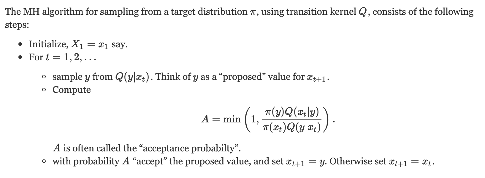

# Methodology 

Monte Carlo Markov chains methods are methods of sampling from a probability distribution in cases we can’t compute and sample from the distribution directly. This can be broken into 2 half, Monte Carlo is the technique to simulate models by generating large number of random samples. Markov Chains are a representation of how random variables change which are governed by the Markov Property where each variable is dependent only on the previous variable in the sequence. Now these two techniques are tied together with some sort of acceptance-rejection sampling which governs the actual MCMC algorithm as a whole. There exists multiple types of MCMC algorithms, we currently use the Metropolis Hastings Algorithm. 

## Metropolis-Hastings Algorithm

The MH algorithm for sampling from a target distribution (posterior of parameters given the processed time series)  $\pi$ using some transition kernel (Gaussian in our case) is given below,

For our case we need to define each of these,

---

### [Likelihood Function $\pi$](https://github.com/WadhwaniAI/covid-modelling/blob/document/main/seir/uncertainty/mcmc.py/#L127)
The likelihood function here defines the probablity of a set of parameters given the time series x,y,z,w. And is defined as $P(\theta | x,y,z,w)$. The likelihood we have chosen is a gaussian likelihood [Link]. Intuitively the probability of those set of parameters $\theta$ will be high which have low loss with predicted time series.
Here the likelihood for a given $\theta$ is calculated as below,
- First generate $\{ \hat{x}_t,\hat{y}_t,\hat{z}_t,\hat{w}_t\}$ by running the predict function of the optimization class MCMC_opt [Link] .
- Then for a certain $\sigma$, $L(\theta)=\prod_{x,y,z}(\prod_k \mathcal{N}(\hat{x}_k|x_k,\sigma))$

Now our problem turns to finding the correct value of $\sigma$. We take a conjugate prior to the Normal distribution as $\sigma \sim InvGamma(\alpha,\beta)$ and keep sampling from the posterior as defined in the KDD paper.

The log_likelihood function calls the [_gaussian_log_likelihood](https://github.com/WadhwaniAI/covid-modelling/blob/document/main/seir/uncertainty/mcmc.py/#L109) which does the actual likelihood computation. THe likelihood function takes a product of likelihoods for all the compartments and their correponding time series $x_t,y_t,z_t$ 

---

### [Transition Kernel Q](https://github.com/WadhwaniAI/covid-modelling/blob/document/main/seir/uncertainty/mcmc.py/#L80)

The transition kernel defines how the chain progresses , i.e. $Q(\theta) = \theta_{new}$ where $\theta_{new}$ must also lie in the uniform prior range of $\theta$. Our transition kernel adds gaussian noise to $\theta$ till its inside the unfiorm prior of the given parameters. 

$Q(\theta) = \theta + \mathcal{z}$ where $\mathcal{z} \sim \mathcal{N}(0,\gamma)$

The corresponding code is in Gauss_proposal

---

### [Acceptance Criteria](https://github.com/WadhwaniAI/covid-modelling/blob/document/main/seir/uncertainty/mcmc.py/#L175)
The acceptance criteria defines whether a proposed sample in the MCMC chain is  accepted or not. Taking cues from the general MH algorithm , the acceptance criteria becomes,

$A = min (1 , \frac{L(\theta_{new}|x_t,y_t,z_t) \times Q(\theta_{new},\theta) }{L(\theta|x_t,y_t,z_t) \times Q(\theta,\theta_{new})})$

If we had an unconstrained parameter space the Q components would have cancelled out, but because of the presence of uniform prior the Q becomes a truncated gaussian [LINK] and the fraction $\frac{Q(\theta_{new},\theta)}{Q(\theta,\theta_{new})}$ becomes $\neq 1$. 

The corresponding code is in the _accept function

# Code level
The main code is kept in the MCMC_Opt class [here](../main/seir/optimisers/mcmc_opt.py). It calls upon the run function after defining the [MCMC class](../main/seir/uncertainty/mcmc.py). 

The main function used in the MCMC class is the [_metropolis function](https://github.com/WadhwaniAI/covid-modelling/blob/document/main/seir/uncertainty/mcmc.py/#L206)

