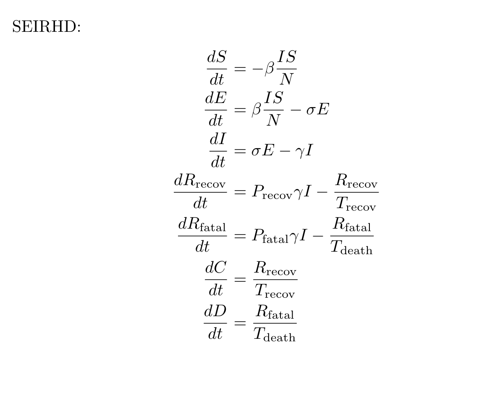
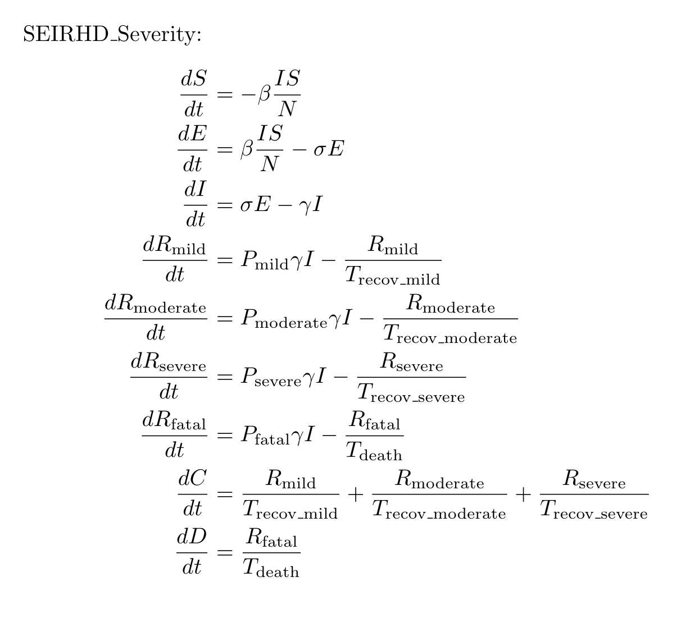
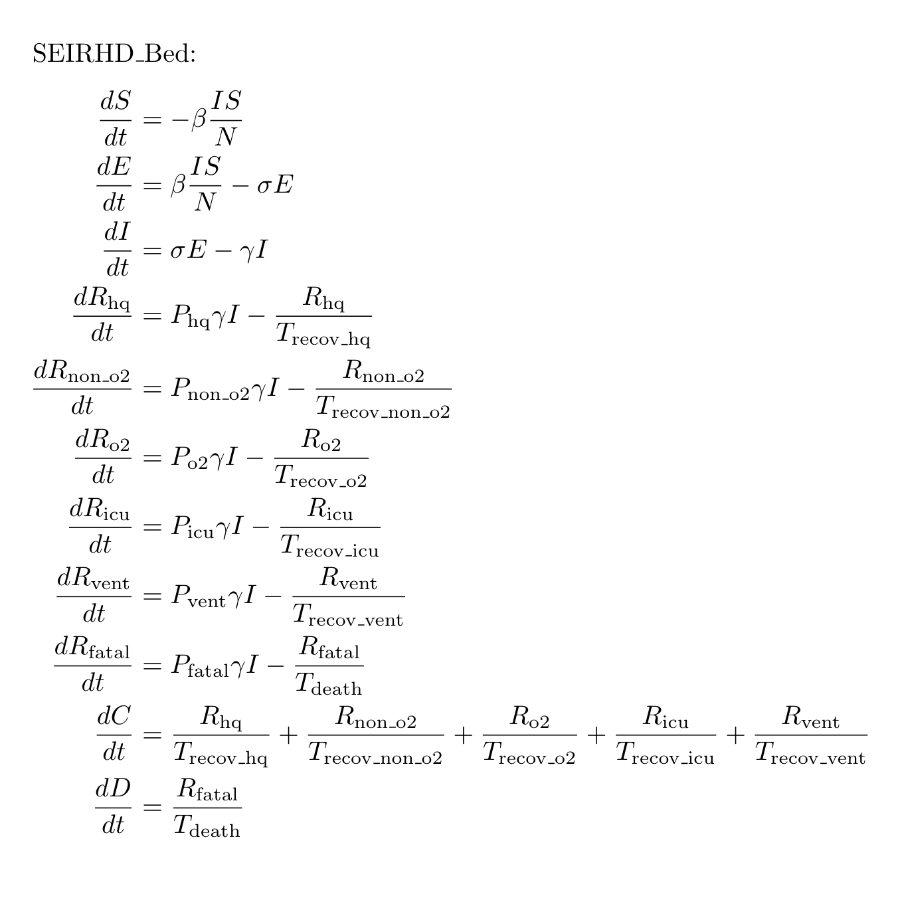

# Compartment Models

We use SEIR based compartment models to do our modelling. 

You can read more about them [here](https://en.wikipedia.org/wiki/Compartmental_models_in_epidemiology) and [here](https://www.idmod.org/docs/emod/hiv/model-seir.html). 

# Our SEIR Models

## SEIRHD

You can find the model diagram [here](model_diagrams/SEIRHD_New.pdf).

## SEIRHD_Severity

You can find the model diagram [here](model_diagrams/SEIRHD_Severity.pdf).

## SEIRHD_Bed

You can find the model diagram [here](model_diagrams/SEIRHD_Bed.pdf).

# Code

## Contributing

All the for all SEIR models is implemented in [models/seir](../models/seir). [models/seir/base.py](../models/seir/base.py) implements an abstract SEIR class (which again is a child of the abstract model class in [models/model.py](../models/model.py)). All SEIR implementations are children of the abstract SEIR class. All SEIR classes will have 2 public functions - `__init__` and `predict`. 

If a user wants to create a new SEIR class, please ensure that it follows the above guidelines. 