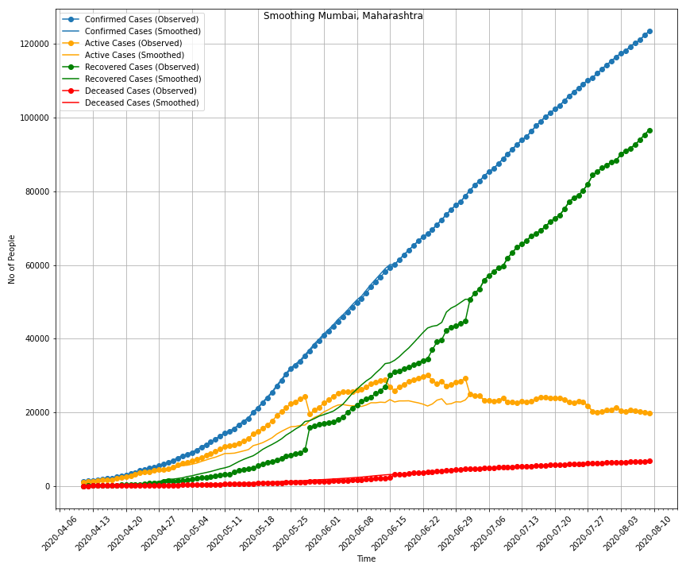
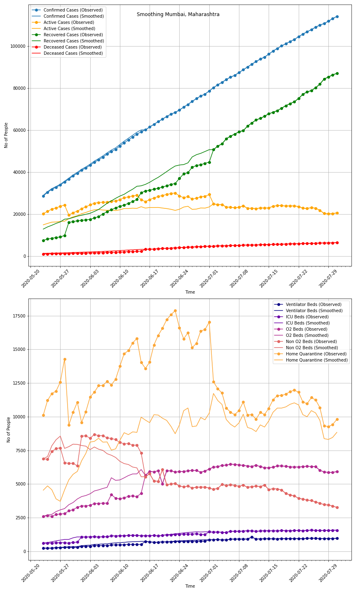

There is a lot of variability in the reporting of cases (due to several factors), and therefore we need to smooth the data before fitting.

# Rolling Average

Rolling Avg params - 
- window size
- left, right or center window
- window type

Currently rolling average is done before the data is split. Therefore, there is slight leakage of data from val to train. For rolling after splitting, dealing with endpoints becomes tricky. For that we have the following options : 
- No RA for endpoints
- Dynamic window (that steadily reduces to 1 at the endpoint)
- Using model prediction as endpoint data input instead

# Spike Smoothing

Sometimes, there is too much delay in reporting some case numbers. The `recovered` data for several days ends up getting reported on a single day due to some data pipeline issues. Mumbai reported ~6200 `recovered` on 1 day, for example. The magnitude of the jump is so large that the distribution of the data prior and post the jump are not the same. Furthermore, the cause of the jump is delay in reporting `recovered`/`deceased`, not those many people actually recovering/dying on that particular day; therefore it is not a reflection of the distribution of true cases. So it is important to smooth the jump back in time such that the post-smoothing curve is A. smooth and B. close to the distribution of true cases. 

### Smoothing Procedure

First, we talk to our goverment client and identify all the spikes. After that, we figure out the rough time period the spike corresponds to. For example, if Mumbai reported 6191 `recovered` on 28th May, over what time did those people actually recover?

Once the spikes and the time periods are figured out, we move to the actual smoothing. 

### Formal Smoothing Formulation

Formally, we want to distribute Y cases for compartment Q (Q can be `recovered`, `deceased`, etc) on day D over a time period of X days (X includes day D).

Suppose the new time series is Q_new\[D-X+1\],...,Q_new\[D\], and the old time series was Q_old\[D-X+1\],...,Q_old\[D\]. For every day i in D-X+1, D-X+2..., D, we want to implement the following :

Q_new\[i\] = w\[i\]*Y + Q_old\[i\]

sum(w\[i\]) for all i in D-X+1, D-X+2..., D is 1.

 There are 4 different methods of implemented for calculating w\[i\] - 
- `uniform` : the weights of each of the X days here is equal
- `weighted-recov` : the weight of day X\[i\] is proportional to the total cases on day (X\[i\] - t_recov), where t_recov is the average recovery time (an input to this smoothing method)
- `weighted-diff` : the weight of day X\[i\] is proportional to the Q(X\[i\] - X\[i-1\]), where Q is the compartment to be smoothed
- `weighted-mag` : the weight of day X\[i\] is proportional to the Q(X\[i\]), where Q is the compartment to be smoothed

Suppose the new time series is Q_new\[D-X+1\],...,Q_new\[D\], and the old time series was Q_old\[D-X+1\],...,Q_old\[D\]. What we have are the following (Assuming Y > 0) : 
- (Q_new\[D-X+1\]+...Q_new\[D\]) - (Q_old\[D-X+1\]+...Q_old\[D\]) = 0
- (Q_new\[D-X+1\]+...Q_new\[D-1\]) - (Q_old\[D-X+1\]+...Q_old\[D-1\]) > 0
- (Q_new\[D\]) - (Q_old\[D\]) < 0

Furthermore, for every smoothing exercise, there is an auxillary variable P that absorbs the smoothing of Q, such that the total (or P+Q) remains constant. Specifically, for every day i in D-X+1, D-X+2..., D, P_new\[i\] = Q_old\[i\] - Q_new\[i\] + P_old\[i\], such that P_new\[i\] + Q_new\[i\] = P_old\[i\] + Q_old\[i\]. 

For example, if Q is `recovered`, then the auxillary variable P will be `active` cases, and their sum with be conserved such that the total case numbers also remains conserved.

`weighted-mag` is the most robust method to small perterbuations in data. `weighted-mag` tends to accentuate any negative perturbations. `weighted-recov` is also robust but it requires an additional parameter from the user which the user A. may not know about, and B. this renders scaling and standardisation tricky.

### Validation of smoothing

Currently smoothing is validated by how accurately the model performs on the test set, and by how realistic the parameters are after fitting to smoothed data. Parameters of unsmoothed data, especially `T_recov` for Mumbai were too unrealistic.

### Smoothing stratified columns

Read more about stratified columns first [here](data.md)

Smoothing for stratified columns has to be done a bit differently. For that we need to understand the difference between independent and dependent time series.

- independent : a time series that is actively kept a track of by the data collectors
- dependent : a time series that is inferred from the independent time series tracked

`total`, `recovered`, `deceased`, are all independent time series. `active` is a dependent time series as its numbers are inferred from the above time series as `active = total - recovered - deceased`. 

Similiarly, when `active` is stratified by some method, among the stratified series, there will be some independent time series and some dependent time series.

- If `active` is stratified by severity, `asymptomatic` is a dependent time series while `symptomatic`, `critical` are 
independent time series. (`asymptomatic = active - symptomatic - critical`)
- If `active` is stratified by bed type, `hq` and `non_o2_beds` are dependent time series while `total_beds`, `o2_beds`, `icu`, `ventilator` are independent time series. (`hq = active - total_beds`, `non_o2_beds = total_beds - o2_beds - icu - ventilator`))

Therefore for smoothing the stratified columns, these are the steps needed:
- First smooth `recovered` and `deceased` to get new inferred `active` time series
- Replace the old inferred `active` series with the new inferred `active` series
- Obtain new `asymptomatic` and `hq` time series from new `active` time series
- Smooth big jumps in stratified columns by taking the new `asymptomatic`/`hq` series as the auxillary compartment in some cases

